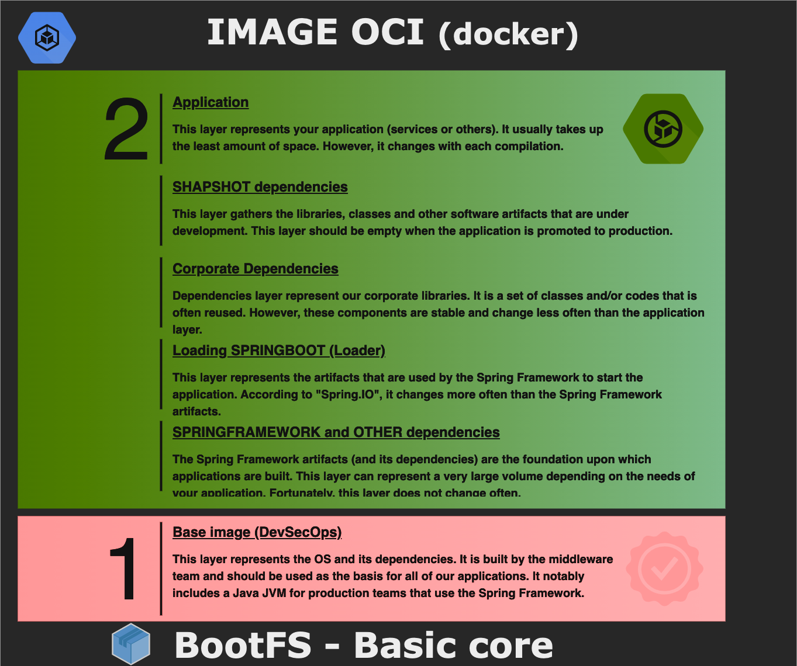
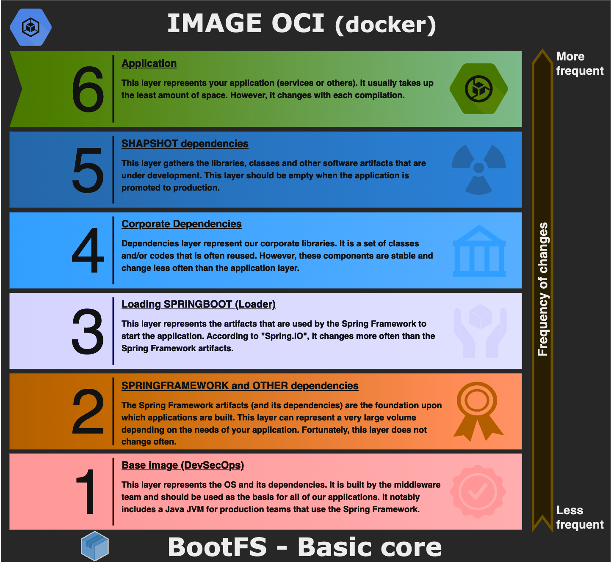

# Best practices for building OCI image (with Docker)

Building an application image is very flexible and relatively easy to implement with OCI tools. However, with all this flexibility/freedom, it is not always easy to discern the activities (and complexity) that are associated with building efficient application image.

The construction of an OCI image can take two directions with this project. The first is to use the facilities of the SpringBoot Framework (mvn spring-boot:build-image). This approach uses buildpack internally. The second is based on docker. As this approach is currently the most popular. We will describe the construction of an OCI image with docker.

## Traditional way

The traditional way of building an OCI image with SpringBoot is to use the fat jar like this example below:

```docker
      FROM arm64v8/amazoncorretto:17
       ARG JAR_FILE=target/dspringboot-nuxt-unspecified.jar
       ADD ${JAR_FILE} app.jar
ENTRYPOINT ["java","-jar","/app.jar"]
```

The final OCI image will have the following structure:



 This approach has significant impacts on performance and management of containers for the following reasons:

* We create an image with only two layers. All changes to your application (even minor) will regenerate a full image (part 2). Image management requires a container registry. The “disk” capacities of the registry are not unlimited. In addition, each image must be checked/certified. The management time spent on images is directly proportional to the volume and quantity of images.
A light image is easier to control/certify. It reduces the attack surface and, therefore, increases the security of images.
* This OCI image uses the fat jar created by SpringBoot. This can impact startup time, especially in a containerized environment. We can save startup time by adding the exploded contents of the jar file instead.
* Operations on a containerization platform will require more resources in terms of: disk space, I/O and memory. The performance impacts will be significant.
* We assume that the CI/CD pipeline has the necessary tools to build the application (java, node and others) with the right versions.

This list represents the main issues for the construction of OCI image. However, several complementary issues must also be taken into consideration when deploying the application inside a containerization platform. The next sections present the technical specifications, norms and standards in order to address these issues.

## Builder, layers and tools (SprinBoot)

In order to correct these problems from the previous section. We will configure a builder and cut our OCI image into several layers. The end result will look like the following figure:



The containerized application has multiple layers. The first is a base image from the devops (middleware) team. It embeds an OS and its software components (commands, JVM and others). Subsequently, several layers are used to make this application image efficient. The number of layers depends on the context of your application. The layers are ordered according to the frequency of application changes: from “least frequent” to “most frequent”. A layer is rebuilt only if its software components change. However, if a layer changes, then the upper layers will also be rebuilt. This approach makes it possible to address the issues that we have previously identified. Resources are used efficiently.

### Builder

Using a builder allows us to build our application with the development tools we want. Moreover, the image used by our builder is temporary, so we have some freedom to define it.

```docker
                                            # We choose a builder OCI image.
   FROM arm64v8/debian:bullseye-slim as builder
WORKDIR /application                        # We copy the sources,files and tools for the build process.
   COPY src ./src   
   COPY pom.xml .
   COPY layers.xml .
   COPY mvnw .
   COPY .mvn ./.mvn
   COPY maven-with-proxy.xml .
   COPY web-app-jamstack.xml .
                                            # We can make some cleanup.
    RUN rm -rf src/frontend/node_modules    # We need to remove Node Modules from Web Application/App.
    RUN chmod 777 ./mvnw                    # We need to execute Apache/Maven.

    RUN apt update -y                       # The process build requires Node.js and Java/JDK.
    RUN apt install curl -y
    RUN curl -fsSL https://deb.nodesource.com/setup_18.x | bash -
    RUN apt install nodejs -y
    RUN apt install ca-certificates-java -y
    RUN apt install openjdk-17-jdk -y
                                            # We add our configuration elements.
    RUN npm set registry=https://registry.npmjs.org/
    RUN npm config set strict-ssl false --global

                                            # Build ... We launch the construction of our application using our builder.
    RUN ./mvnw -U -B -e -f pom.xml clean prepare-package package
```

* [Source : Dockerfile](../Dockerfile)

These activities will create our application. It is important to note that a SpringBoot plugin will create a JAR with a breakdown of our components according to our specifications.

```xml
<plugin>
    <groupId>org.springframework.boot</groupId>
    <artifactId>spring-boot-maven-plugin</artifactId>
    <version>${spring.boot.version}</version>
        <configuration>
            <layers>
                <enabled>true</enabled>
                    <configuration>${project.basedir}/layers.xml</configuration>
                </layers>
        </configuration>
        ...
</plugin>
```

* [Source : pom.xml](../pom.xml)

Our specification for the layers in our application is controlled by the layers.xml file. The SpringBoot plugin will use these specifications for the construction of our application JAR.

```xml
<layers xmlns="http://www.springframework.org/schema/boot/layers"
        xmlns:xsi="http://www.w3.org/2001/XMLSchema-instance"
        xsi:schemaLocation="http://www.springframework.org/schema/boot/layers
                            http://www.springframework.org/schema/boot/layers/layers-2.7.xsd">
    <!--
        Your app.
        The "loader" is considered to be a stakeholder.

        Att: This section uses pattern definition with style (Ant) -> /package/sub-package/**. We manipulate classes.
      -->
    <application>
        <into layer="spring-boot-loader">
            <include>org/springframework/boot/loader/**</include>
        </into>
        <into layer="application"/>
    </application>
    <!--
        Dependency management.
        Including a project with modules:
            <includeModuleDependencies/> Include submodules.
            <excludeModuleDependencies/> Exclude submodules.

        Att: This section uses pattern definition with the format -> group:artifact[:version]. We handle jars.
      -->
    <dependencies>
        <into layer="application">
            <includeModuleDependencies/> <!-- Example only. -->
        </into>
        <into layer="snapshot-dependencies">
            <include>*:*:*SNAPSHOT</include>
        </into>
        <into layer="corpo-dependencies"> <!-- Example. We simulate one or more JARS/Corporate Libraries. -->
            <include>com.fasterxml.jackson.core:*</include>
        </into>
        <into layer="framework-dependencies"/>
    </dependencies>
    <!-- The order of the layers is important. From those that change the least to the most often. -->
    <layerOrder>
        <layer>framework-dependencies</layer>  <!-- Doesn't change often. SpringFramework, libraries and others. -->
        <layer>spring-boot-loader</layer>      <!-- SpringBoot/Loader changes more often than SpringFramework.   -->
        <layer>corpo-dependencies</layer>      <!-- May change often... But less than app/system.                -->
        <layer>snapshot-dependencies</layer>   <!-- SNAPSHOT artifacts change more often than the rest.          -->
        <layer>application</layer>             <!-- Layer that changes most often normally. It's your app.       -->
    </layerOrder>
</layers>
```

* [Source : pom.xml](../layers.xml)

The final application is in the form of a JAR. We need to extract the different layers in order to prepare the construction of our final OCI image. To perform this extraction, we use a SpringBoot tool: layertools.

```docker
    ARG JAR_FILE=target/*.jar # We prepare the SpringBoot application layers.
    RUN cp ${JAR_FILE} application.jar
    RUN java -Djarmode=layertools -jar application.jar extract
```

* [Source : Dockerfile](../Dockerfile)

### OCI image

We are now ready to build our OCI image with the components from our builder.

```docker
   FROM arm64v8/amazoncorretto:17
#
# Identification.
    ARG LABEL_TITLE="Please, provide a title."
    ARG LABEL_DESCRIPTION="Please, provide a description."
    ARG LABEL_CREATED="2023-99-99"
#
# Version : MAJOR.MINOR.REVISION-BUILD.
    ARG LABEL_VERSION_MAJOR="1"
    ARG LABEL_VERSION_MINOR="0"
    ARG LABEL_VERSION_REVISION="0"
    ARG LABEL_VERSION_BUILD="#1"
  LABEL app.image.title=${LABEL_TITLE}
  LABEL app.image.description=${LABEL_DESCRIPTION}
  LABEL app.image.created=${LABEL_CREATED}
  LABEL app.image.version.major=${LABEL_VERSION_MAJOR}
  LABEL app.image.version.minor=${LABEL_VERSION_MINOR}
  LABEL app.image.version.revison=${LABEL_VERSION_REVISION}
  LABEL app.image.version.build=${LABEL_VERSION_BUILD}
WORKDIR /application
   COPY --from=builder application/framework-dependencies/ ./
   COPY --from=builder application/spring-boot-loader/ ./
   COPY --from=builder application/corpo-dependencies/ ./
   COPY --from=builder application/snapshot-dependencies/ ./
   COPY --from=builder application/application/ ./
#
# ----------------------------------------------------------------------------------------
# Entry point.
ENTRYPOINT ["java", "org.springframework.boot.loader.JarLauncher"]
```

* [Source : Dockerfile](../Dockerfile)

### OCI image explorer (dive)

DIVE is a "free software" tool maintained by Alex Goodman. It allows to consult the layers of an application image.
Download and documentation are available under GitHub: https://github.com/wagoodman/dive. The following figure shows a working session with this tool.


## Links/references used for writing

* [Whats New in Spring Boot 2.3 - Docker build](https://www.youtube.com/watch?v=WL7U-yGfUXA)