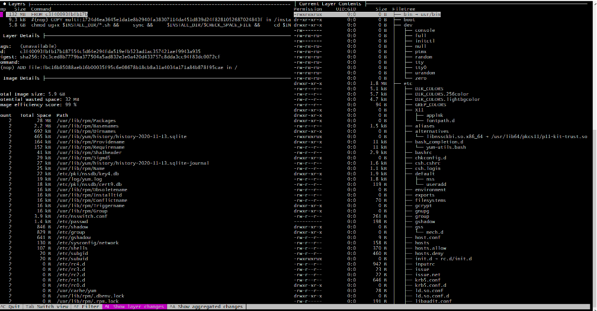

# Best Practices for Building OCI Images with Docker

Building application images using OCI tools is flexible and relatively straightforward. However, this flexibility can introduce complexity when aiming for efficient and manageable images.

This project supports two main approaches for OCI image construction:

1. **Spring Boot Buildpack:** Using the Spring Boot Maven plugin (`mvn spring-boot:build-image`), which leverages buildpacks internally.
2. **Docker:** The most popular method, described in detail below.

## Traditional Approach

The conventional method for building a Spring Boot OCI image uses a fat JAR, as shown:

```docker
FROM arm64v8/amazoncorretto:17
ARG JAR_FILE=target/dspringboot-nuxt-unspecified.jar
ADD ${JAR_FILE} app.jar
ENTRYPOINT ["java","-jar","/app.jar"]
```

The resulting OCI image structure:


**Drawbacks of this approach:**

- Only two layers are created. Any application change regenerates the entire image, increasing registry storage and certification overhead.
- Fat JARs can slow startup, especially in containers. Exploding the JAR contents can improve performance.
- Container platforms require more disk, I/O, and memory resources, impacting performance.
- The CI/CD pipeline must provide all necessary build tools (Java, Node, etc.) with correct versions.

These are the main challenges. The following sections outline technical specifications and standards to address them.

## Builder, Layers, and Tools (Spring Boot)

To resolve the above issues, configure a builder and split the OCI image into multiple layers:


**Layering Strategy:**

- The base image (from DevOps) includes the OS and essential software (JVM, commands).
- Additional layers are ordered by change frequency, from least to most frequent.
- Only changed layers and those above them are rebuilt, optimizing resource usage.

### Builder Example

A builder image allows you to use custom development tools. The builder image is temporary and flexible.

```docker
FROM arm64v8/debian:bullseye-slim as builder
WORKDIR /application
COPY src ./src   
COPY pom.xml .
COPY layers.xml .
COPY mvnw .
COPY .mvn ./.mvn
COPY maven-with-proxy.xml .
COPY web-app-jamstack.xml .
RUN rm -rf src/frontend/node_modules
RUN chmod 777 ./mvnw

RUN apt update -y
RUN apt install curl -y
RUN curl -fsSL https://deb.nodesource.com/setup_18.x | bash -
RUN apt install nodejs -y
RUN apt install ca-certificates-java -y
RUN apt install openjdk-17-jdk -y

RUN npm set registry=https://registry.npmjs.org/
RUN npm config set strict-ssl false --global

RUN ./mvnw -U -B -e -f pom.xml clean prepare-package package
```

*Source: [Dockerfile](../Dockerfile)*

The Spring Boot Maven plugin can be configured to create layered JARs:

```xml
<plugin>
    <groupId>org.springframework.boot</groupId>
    <artifactId>spring-boot-maven-plugin</artifactId>
    <version>${spring.boot.version}</version>
    <configuration>
        <layers>
            <enabled>true</enabled>
            <configuration>${project.basedir}/layers.xml</configuration>
        </layers>
    </configuration>
</plugin>
```

*Source: [pom.xml](../pom.xml)*

Layer specifications are defined in `layers.xml`:

```xml
<layers xmlns="http://www.springframework.org/schema/boot/layers"
        xmlns:xsi="http://www.w3.org/2001/XMLSchema-instance"
        xsi:schemaLocation="http://www.springframework.org/schema/boot/layers
                            http://www.springframework.org/schema/boot/layers/layers-2.7.xsd">
    <application>
        <into layer="spring-boot-loader">
            <include>org/springframework/boot/loader/**</include>
        </into>
        <into layer="application"/>
    </application>
    <dependencies>
        <into layer="application">
            <includeModuleDependencies/>
        </into>
        <into layer="snapshot-dependencies">
            <include>*:*:*SNAPSHOT</include>
        </into>
        <into layer="corpo-dependencies">
            <include>com.fasterxml.jackson.core:*</include>
        </into>
        <into layer="framework-dependencies"/>
    </dependencies>
    <layerOrder>
        <layer>framework-dependencies</layer>
        <layer>spring-boot-loader</layer>
        <layer>corpo-dependencies</layer>
        <layer>snapshot-dependencies</layer>
        <layer>application</layer>
    </layerOrder>
</layers>
```

*Source: [layers.xml](../layers.xml)*

After building, extract the layers using Spring Boot's layertools:

```docker
ARG JAR_FILE=target/*.jar
RUN cp ${JAR_FILE} application.jar
RUN java -Djarmode=layertools -jar application.jar extract
```

*Source: [Dockerfile](../Dockerfile)*

### Final OCI Image

Build the final OCI image using the extracted layers:

```docker
FROM arm64v8/amazoncorretto:17

ARG LABEL_TITLE="Please, provide a title."
ARG LABEL_DESCRIPTION="Please, provide a description."
ARG LABEL_CREATED="2023-99-99"
ARG LABEL_VERSION_MAJOR="1"
ARG LABEL_VERSION_MINOR="0"
ARG LABEL_VERSION_REVISION="0"
ARG LABEL_VERSION_BUILD="#1"

LABEL app.image.title=${LABEL_TITLE}
LABEL app.image.description=${LABEL_DESCRIPTION}
LABEL app.image.created=${LABEL_CREATED}
LABEL app.image.version.major=${LABEL_VERSION_MAJOR}
LABEL app.image.version.minor=${LABEL_VERSION_MINOR}
LABEL app.image.version.revison=${LABEL_VERSION_REVISION}
LABEL app.image.version.build=${LABEL_VERSION_BUILD}

WORKDIR /application
COPY --from=builder application/framework-dependencies/ ./
COPY --from=builder application/spring-boot-loader/ ./
COPY --from=builder application/corpo-dependencies/ ./
COPY --from=builder application/snapshot-dependencies/ ./
COPY --from=builder application/application/ ./

ENTRYPOINT ["java", "org.springframework.boot.loader.JarLauncher"]
```

*Source: [Dockerfile](../Dockerfile)*

### OCI Image Explorer: Dive

[Dive](https://github.com/wagoodman/dive) by Alex Goodman is a free tool for inspecting image layers. Example session:



## References

- [What's New in Spring Boot 2.3 - Docker build](https://www.youtube.com/watch?v=WL7U-yGfUXA)
